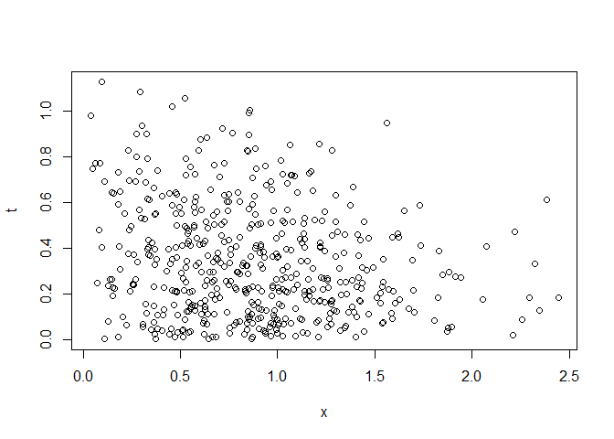
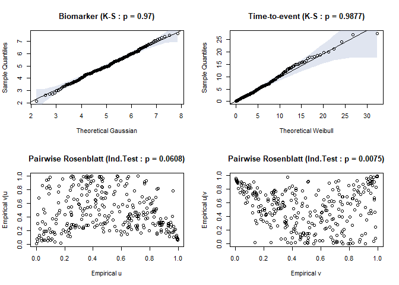
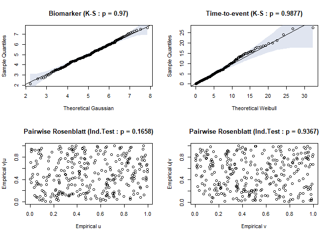
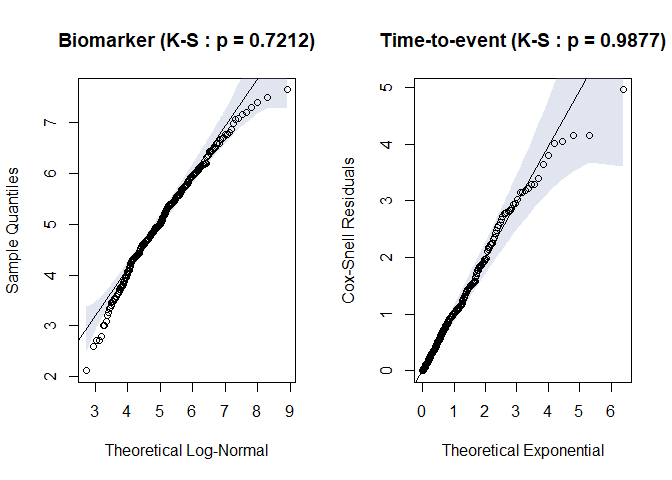
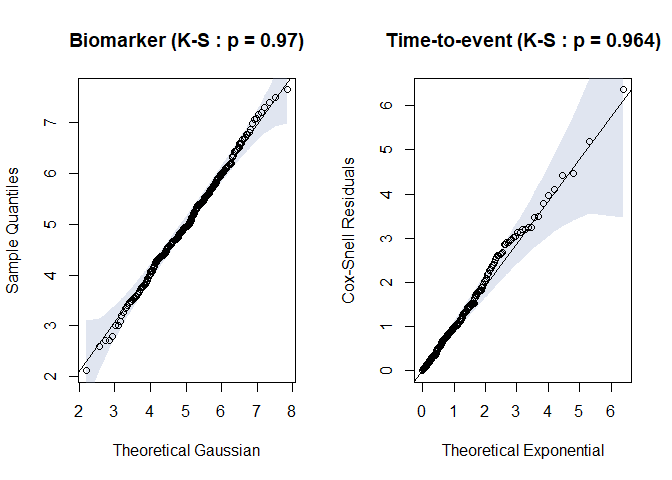
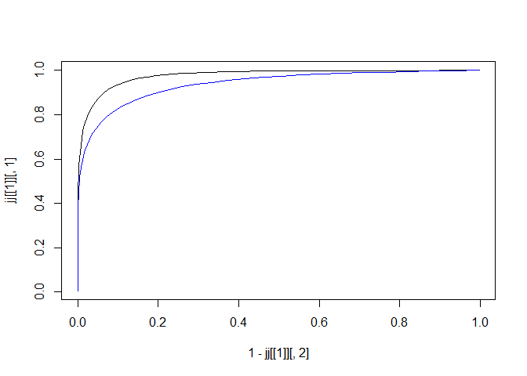
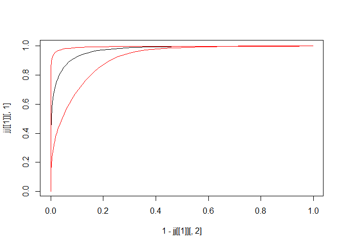

<!-- README.md is generated from README.Rmd. Please edit that file -->

# parTimeROC

<!-- badges: start -->
<!-- badges: end -->

The goal of parTimeROC is to store methods and procedures needed to run
the time-dependent ROC analysis parametrically. This package adopts two
different theoretical framework to produce the ROC curve which are from
the proportional hazard model and copula function. Currently, this
package only able to run analysis for single covariate/biomarker with
survival time. The future direction for this work is to be able to
include analysis for multiple biomarkers with longitudinal measurements.

## Installation

You can install the development version of parTimeROC from
[GitHub](https://github.com/) with:

``` r
# install.packages("devtools")
devtools::install_github("FaizAzhar/parTimeROC")
```

## Theoretical Framework

A receiver operating characteristics (ROC) curve is a curve that
measures a model’s accuracy to correctly classify a population into a
binary status (eg: dead/alive). The curve acts as a tool for analysts to
compare which model is suitable to be used as a classifiers. However, in
survival analysis, it is noted that the status of population fluctuate
across time. Thus, a standard ROC analysis might underestimates the true
accuracy measurement that the classification model have. In a situation
where the population might enter or exit any of the two status over
time, including the time component into the ROC analysis is shown to be
superior and can help analysts to assess the performance of the model’s
accuracy over time. In addition, a time-dependent ROC can also show at
which specific time point a model will have a similar performance
measurement with other model.

For the time being, two methods are frequently used when producing the
time-dependent ROC curve. The first method employs the Cox proportional
hazard model (PH) to estimate the joint distribution of the covariates
and time-to-event. The second method employs a copula function which
link the marginal distributions of covariates and time-to-event to
estimate its joint distribution. After obtaining estimates for the joint
distribution, two metrics can be computed which is the time-dependent
sensitivity and specificity. Plotting these two informations will
generate the desired time-dependent ROC curve.

## Usage

Explanations below are showing the functions that can be found within
`parTimeROC` package and its implementation.

### `timeroc_obj`

Following an OOP approaches, a `TimeROC` object can be initialized by
using the `parTimeROC::timeroc_obj()` method.

``` r
test <- parTimeROC::timeroc_obj("normal-gompertz-PH")
print(test)
#> Model Assumptions: Proportional Hazard (PH)
#> X                : Gaussian
#> Time-to-Event    : Gompertz
test <- parTimeROC::timeroc_obj("normal-gompertz-copula", copula = "gumbel90")
print(test)
#> Model Assumptions: 90 Degrees Rotated Gumbel Copula
#> X                : Gaussian
#> Time-to-Event    : Gompertz
```

Notice that we included the print method to generate the summary for the
`test` object which has a `TimeROC` class.

A list of distributions and copula have been stored within this package.
It is accessible via the `get.distributions` or `get.copula` script.

``` r
names(parTimeROC::get.distributions)
#> [1] "exponential" "weibull"     "gaussian"    "normal"      "lognormal"  
#> [6] "gompertz"    "skewnormal"
names(parTimeROC::get.copula)
#> [1] "gaussian"  "clayton90" "gumbel90"  "joe90"
```

### `rtimeroc`

Common tasks in mathematical modelling are prepared. For simulation
purposes, procedure to generate random data from PH or copula function
is created. The random data can be obtained using the
`parTimeROC::rtimeroc()`. The `parTimeROC::rtimeroc()` returns a
dataframe of 3 columns (t, x, status).

``` r
library(parTimeROC)
## PH model
test <- timeroc_obj(dist = 'weibull-gompertz-PH')
set.seed(23456)
rr <- rtimeroc(obj = test, censor.rate = 0.5, n=500,
               params.t = c(shape=2, rate=1),
               params.x = c(shape=2, scale=1),
               params.ph=0.5)
plot(t~x, rr)
```

<div class="figure" style="text-align: center">


<p class="caption">
Fig.1. Random data of biomarker and time-to-event
</p>

</div>

### `timeroc_fit`

We also can fit datasets that have time-to-event, covariates and status
columns with the PH or copula model using the
`parTimeROC::timeroc_fit()`.

For PH model, two fitting processes are done. One is to fit the
biomarker distribution alone. Another is to fit the time-to-event that
is assumed to follow a proportional hazard model.

Meanwhile, for copula method, the IFM technique is used due to its light
computational requirement. Three fitting processes are conducted. One is
to fit the marginal distribution for biomarker, another is to fit the
marginal time-to-event. And lastly is to fit the copula function.

``` r
library(parTimeROC)
## fitting copula model
test <- timeroc_obj(dist = 'gompertz-gompertz-copula', copula = "gumbel90")
set.seed(23456)
rr <- rtimeroc(obj = test, censor.rate = 0, n=500,
               params.t = c(shape=3,rate=1),
               params.x = c(shape=1,rate=2),
               params.copula=-5) # name of parameter must follow standard

cc <- timeroc_fit(rr$x, rr$t, rr$event, obj = test)
print(cc)
#> Model:  gompertz-gompertz-copula 
#> ------
#> X (95% CI) :
#> AIC =  -65.51402 
#>          est    low  upper     se
#> shape 0.9343 0.6216 1.2469 0.1595
#> rate  2.0931 1.7975 2.3887 0.1508
#> ------
#> Time-to-Event (95% CI) :
#> AIC =  -141.7148 
#>          est    low  upper     se
#> shape 3.0894 2.7066 3.4722 0.1953
#> rate  0.9160 0.7547 1.0774 0.0823
#> ------
#> Copula (95% CI) :
#> AIC =  -1432.074 
#>           est     low   upper     se
#> theta -5.1126 -5.4868 -4.7384 0.1909
```

Notice that the print method also can be used to print the results
obtained from the fitting process.

### `timeroc_gof`

After fitting the model with either PH or copula model, its
goodness-of-fit can be examined through the function
`parTimeROC::timeroc_gof()`. This will return a list of test statistic
and p-values denoting misspecification of model or not.
Kolmogorov-Smirnov testing is performed for model checking. If
`p-value < 0.05`, we reject the null hypothesis that the data (biomarker
or time-to-event) are following the assumed distribution.

For copula model, additional testing is needed to check whether the
copula used is able to model the data or not. After using the Rosenblatt
transformation, we conduct an independent testing to check whether the
empirical conditional and cumulative distribution are independent. If
the `p-value < 0.05`, we reject the null hypothesis which stated that
the conditional and cumulative are independent. Thus, for
`p-value < 0.05`, the copula failed to provide a good estimation for the
joint distribution.

``` r
library(parTimeROC)
# Copula model
rt <- timeroc_obj("normal-weibull-copula",copula="clayton90")
set.seed(1)
rr <- rtimeroc(rt, n=300, censor.rate = 0,
               params.x = c(mean=5, sd=1),
               params.t = c(shape=1, scale=5),
               params.copula = -2.5)
test <- timeroc_obj("normal-weibull-copula",copula="gumbel90")
jj <- timeroc_fit(test, rr$x, rr$t, rr$event)

timeroc_gof(jj)
```

<div class="figure" style="text-align: center">


<p class="caption">
Fig.2. Residual plots for biomarker and time-to-event distribution when
misspecified
</p>

</div>

    #> $ks_x
    #> 
    #>  Asymptotic two-sample Kolmogorov-Smirnov test
    #> 
    #> data:  df$x and theo.q
    #> D = 0.04, p-value = 0.97
    #> alternative hypothesis: two-sided
    #> 
    #> 
    #> $ks_t
    #> 
    #>  Asymptotic two-sample Kolmogorov-Smirnov test
    #> 
    #> data:  df$t and theo.q
    #> D = 0.036667, p-value = 0.9877
    #> alternative hypothesis: two-sided
    #> 
    #> 
    #> $ind_u
    #> $ind_u$statistic
    #> [1] 2.028391
    #> 
    #> $ind_u$p.value
    #> [1] 0.04252035
    #> 
    #> 
    #> $ind_v
    #> $ind_v$statistic
    #> [1] 2.691851
    #> 
    #> $ind_v$p.value
    #> [1] 0.007105664

``` r
test <- timeroc_obj("normal-weibull-copula",copula="clayton90")
jj <- timeroc_fit(test, rr$x, rr$t, rr$event)

timeroc_gof(jj)
```

<div class="figure" style="text-align: center">


<p class="caption">
Fig.3. Residual plots for biomarker and time-to-event distribution when
correct specification
</p>

</div>

    #> $ks_x
    #> 
    #>  Asymptotic two-sample Kolmogorov-Smirnov test
    #> 
    #> data:  df$x and theo.q
    #> D = 0.04, p-value = 0.97
    #> alternative hypothesis: two-sided
    #> 
    #> 
    #> $ks_t
    #> 
    #>  Asymptotic two-sample Kolmogorov-Smirnov test
    #> 
    #> data:  df$t and theo.q
    #> D = 0.036667, p-value = 0.9877
    #> alternative hypothesis: two-sided
    #> 
    #> 
    #> $ind_u
    #> $ind_u$statistic
    #> [1] 1.465733
    #> 
    #> $ind_u$p.value
    #> [1] 0.1427209
    #> 
    #> 
    #> $ind_v
    #> $ind_v$statistic
    #> [1] 0.1520429
    #> 
    #> $ind_v$p.value
    #> [1] 0.8791531

``` r
library(parTimeROC)
# PH model
rt <- timeroc_obj("normal-weibull-PH")
set.seed(1)
rr <- rtimeroc(rt, n=300, censor.rate = 0,
              params.x = c(mean=5, sd=1),
              params.t = c(shape=1, scale=5),
              params.ph = 1.2)
test <- timeroc_obj("lognormal-lognormal-PH")
jj <- timeroc_fit(test, rr$x, rr$t, rr$event)
timeroc_gof(jj)
```

<div class="figure" style="text-align: center">


<p class="caption">
Fig.4. Residual plots for biomarker and time-to-event distribution when
misspecified
</p>

</div>

    #> $ks_x
    #> 
    #>  Asymptotic two-sample Kolmogorov-Smirnov test
    #> 
    #> data:  df$x and theo.q
    #> D = 0.056667, p-value = 0.7212
    #> alternative hypothesis: two-sided
    #> 
    #> 
    #> $ks_t
    #> 
    #>  Asymptotic one-sample Kolmogorov-Smirnov test
    #> 
    #> data:  df$coxsnell
    #> D = 0.035368, p-value = 0.8472
    #> alternative hypothesis: two-sided

``` r
test <- timeroc_obj("normal-weibull-PH")
jj <- timeroc_fit(test, rr$x, rr$t, rr$event)
timeroc_gof(jj)
```

<div class="figure" style="text-align: center">


<p class="caption">
Fig.5. Residual plots for biomarker and time-to-event distribution when
correct specification
</p>

</div>

    #> $ks_x
    #> 
    #>  Asymptotic two-sample Kolmogorov-Smirnov test
    #> 
    #> data:  df$x and theo.q
    #> D = 0.04, p-value = 0.97
    #> alternative hypothesis: two-sided
    #> 
    #> 
    #> $ks_t
    #> 
    #>  Asymptotic one-sample Kolmogorov-Smirnov test
    #> 
    #> data:  df$coxsnell
    #> D = 0.029988, p-value = 0.9502
    #> alternative hypothesis: two-sided

### `timeroc_predict`

Finally, after fitting process, we can predict the value of sensitivity
and specificity of the covariates at specific time point using the
`parTimeROC::timeroc_predict()` function. This will return a list of
dataframe for each specified time.

``` r
library(parTimeROC)
# Copula model
test <- timeroc_obj(dist = 'gompertz-gompertz-copula', copula='clayton90',
params.t = c(shape=3,rate=1),
params.x = c(shape=1,rate=2),
params.copula=-5)

set.seed(23456)
rr <- rtimeroc(obj = test, censor.rate = 0.2, n=500)
cc <- timeroc_fit(x=rr$x, t=rr$t, event=rr$event, obj = test)

jj <- timeroc_predict(cc, t = quantile(rr$t,probs = c(0.25, 0.5)))
plot(x = 1-jj[[1]][,2], y = jj[[1]][,1], type = 'l')
lines(x = 1-jj[[2]][,2], y = jj[[2]][,1], col = 'blue')
```

<div class="figure" style="text-align: center">


<p class="caption">
Fig.6. ROC curve at 25th & 50th quantile points of time-to-event
</p>

</div>

We also can specify the number of bootstrap process that we want if
confidence interval of the ROC curve need to be computed. The bootstrap
procedure can be achieved by supplying `B = bootstrap value` into the
`parTimeROC::timeroc_predict()` function.

``` r
library(parTimeROC)
# Copula model
test <- timeroc_obj(dist = 'gompertz-gompertz-copula', copula='clayton90',
params.t = c(shape=3,rate=1),
params.x = c(shape=1,rate=2),
params.copula=-5)

set.seed(23456)
rr <- rtimeroc(obj = test, censor.rate = 0.2, n=500)
cc <- timeroc_fit(x=rr$x, t=rr$t, event=rr$event, obj = test)

jj <- timeroc_predict(cc, t = quantile(rr$t,probs = c(0.25)), B = 500)

plot(x = 1-jj[[1]][,2], y = jj[[1]][,1], type = 'l')
lines(x = 1-jj[[1]][,4], y = jj[[1]][,3], col = 'red')
lines(x = 1-jj[[1]][,6], y = jj[[1]][,5], col = 'red')
```

<div class="figure" style="text-align: center">


<p class="caption">
Fig.7. 95% boot confidence interval of ROC curve at 25th time-to-event
</p>

</div>

### `timeroc_auc`

Function to compute the area under the ROC curve using the
`parTimeROC::timeroc_auc()` is also prepared for user convenience.

``` r
test <- timeroc_obj('normal-weibull-copula', copula = 'clayton90')
print(test)
#> Model Assumptions: 90 Degrees Rotated Clayton Copula
#> X                : Gaussian
#> Time-to-Event    : Weibull

set.seed(23456)
rr <- rtimeroc(obj = test, censor.rate = 0.1, n=500,
               params.t = c(shape=1, scale=5),
               params.x = c(mean=5, sd=1),
               params.copula=-2)

cc <- timeroc_fit(x=rr$x, t=rr$t, event=rr$event, obj = test)

jj <- timeroc_predict(cc, t = quantile(rr$t, probs = c(0.25,0.5,0.75)),
                      B = 500)

print(timeroc_auc(jj))
#>               time   est.auc   low.auc   upp.auc
#> 1 1.67162499336611 0.8870603 0.8359451 0.9290326
#> 2 3.82232388405918 0.8204010 0.7656753 0.8666275
#> 3 7.39650943317648 0.7724798 0.7163410 0.8197035
```

## Funding

Universiti Teknologi Malaysia (UTM), UTM Fundamental Research (UTMFR)
Vote No: Q.J130000.3854.22H03.

## References

1.  R. Etzioni, M. Pepe, G. Longton, C. Hu, G. Goodman, Incorporating
    the Time Dimension in Receiver Operating Characteristic Curves: A
    Case Study of Prostate Cancer, *Medical Decision Making*,
    **19(3)**:242–51 (1999)

2.  P.J. Heagerty, T. Lumley, M.S. Pepe, Time-Dependent ROC Curves for
    Censored Survival Data and a Diagnostic Marker, *Biometrics*,
    **56(2)**:337–44 (2000)

3.  I. Unal, Defining an Optimal Cut-Point Value in ROC Analysis: An
    Alternative Approach, *Computational and Mathematical Methods in
    Medicine*, 1–14 (2017)

4.  P. Martínez-Camblor, J.C. Pardo-Fernández, Smooth time-dependent
    receiver operating characteristic curve estimators, *Statistical
    Methods in Medical Research*, **27(3)**:651–74 (2018)

5.  K.M. Beyene, A. El Ghouch, Smoothed time‐dependent receiver
    operating characteristic curve for right censored survival data,
    *Statistics in Medicine*, **39(24)**:3373–96 (2020)

6.  S. Díaz-Coto, P. Martínez-Camblor, S. Pérez-Fernández,
    smoothROCtime: an R package for time-dependent ROC curve estimation,
    *Computational Statistics*, **35(3)**:1231–51 (2020)

7.  Y. Zheng, P.J. Heagerty, Semiparametric estimation of time-dependent
    ROC curves for longitudinal marker data, *Biostatistics*,
    **5(4)**:615–32 (2004)

8.  R. Xu, J. O’Quigley, A 𝑅2 type measure of dependence for
    proportional hazards models, *Journal of Nonparametric Statistics*,
    **12(1)**:83–107 (1999)

9.  D. Rizopoulos. Joint models for longitudinal and time-to-event data:
    With applications in R, *CRC Press* (2012)

10. R. Kolamunnage-Dona, A.N. Kamarudin, Adjustment for the measurement
    error in evaluating biomarker performances at baseline for future
    survival outcomes: Time-dependent receiver operating characteristic
    curve within a joint modelling framework, *Research Methods in
    Medicine & Health Sciences*, **2(2)**:51–60 (2021)

11. A.N. Kamarudin, T. Cox, R. Kolamunnage-Dona, Time-dependent ROC
    curve analysis in medical research: current methods and
    applications, *BMC Medical Research Methodology*, **17(1)**:53
    (2017)

12. M.S. Pepe, Y. Zheng, Y. Jin, Y. Huang, C.R. Parikh, W.C. Levy,
    Evaluating the ROC performance of markers for future events,
    *Lifetime Data Analysis*, **14(1)**:86–113 (2008)

13. A. Azzalini, A class of distributions which includes the normal
    ones, *Scandinavian Journal of Statistics*, 199–208 (1985)

14. J. Kalbfleisch, R. Prentice, The Statistical Analysis of Failure
    Time Data, *John Wiley and Sons* (1980)

15. G. Brostrom, Event History Analysis with R, *Chapman & Hall/CRC*,
    85–112 (2012)

16. S.K. Khosa, Parametric Proportional Hazard Models with Applications
    in Survival Analysis (2019)

17. J.E. Angus. The Probability Integral Transform and Related Results,
    *SIAM Review*, **36(4)**:652–4 (1994)

18. P.L. Ramos, D.C.F. Guzman, A.L. Mota, F.A. Rodrigues, F. Louzada,
    Sampling with censored data: a practical guide (2020)

19. R. Kelter, Bayesian identification of structural coefficients in
    causal models and the causal false-positive risk of confounders and
    colliders in linear Markovian models, *BMC Medical Research
    Methodology*, **22(1)**:58 (2022)

20. B. Narasimhan, M. Koller, S.G. Johnson, T. Hahn, A. Bouvier, K.
    Kiêu, et al., cubature: Adaptive Multivariate Integration over
    Hypercubes, available from: <https://bnaras.github.io/cubature/>
    \[cited 2023 Dec 4\]

21. C.W. Clenshaw, A.R. Curtis, A method for numerical integration on an
    automatic computer, *Numerische Mathematik (Heidelb)*,
    **2(1)**:197–205 (1960)

22. S. Díaz-Coto, N.O. Corral-Blanco, P. Martínez-Camblor, Two-stage
    receiver operating-characteristic curve estimator for cohort
    studies, *International Journal of Biostatistics*, **17(1)**:117–37
    (2021)

23. W.N. Street, O.L. Mangasarian, W.H. Wolberg, An Inductive Learning
    Approach to Prognostic Prediction, in Machine Learning Proceedings
    1995, *Elsevier*; 522–30 (1995)

24. P. Bühlmann, T. Hothorn, Boosting Algorithms: Regularization,
    Prediction and Model Fitting, *Statistical Science*, **22(4)**
    (2007)

25. Z. Zhang, J. Reinikainen, K.A. Adeleke, M.E. Pieterse, C.G.M
    GroothuisOudshoorn, Time-varying covariates and coefficients in Cox
    regression models, *Annals of Translational Medicine*,
    **6(7)**:121–121 (2018)

26. Z. Zhang, C. Charalambous, P. Foster, A Gaussian copula joint model
    for longitudinal and time-to-event data with random effects,
    *Computational Statistics & Data Analysis* (2023)

27. G. Escarela, A.R. Vásquez, G. González-Farías, J.U. Márquez-Urbina,
    Copula modeling for the estimation of measures of marker
    classification and predictiveness performance with survival
    outcomes, *Statistical Methods in Medical Research* (2023)

28. M. Ganjali, T. Baghfalaki, A Copula Approach to Joint Modeling of
    Longitudinal Measurements and Survival Times Using Monte Carlo
    Expectation-Maximization with Application to AIDS Studies, *Journal
    Biopharmaceutical Statistics*, **25(5)**:1077–99 (2015)
